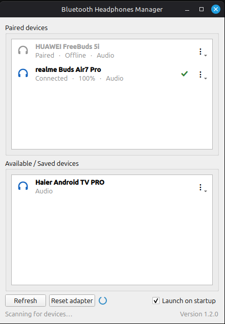
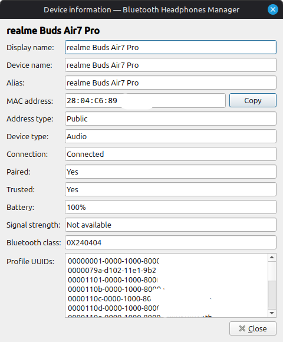

<h1 align="center">🎧 Bluetooth Headphones Manager</h1>

<p align="center">
  <strong>One-click Bluetooth audio device manager and system tray app for Linux Mint/Cinnamon and LXQt, built with Qt 6 and BlueZ D-Bus.</strong>
</p>

<p align="center">
  Click a device once to pair, trust and connect it automatically — an Android-like Bluetooth experience for the Linux desktop.
</p>

<p align="center">
  <a href="https://github.com/antoh1986/bluetooth-headphones-manager/releases/latest"></a>
  
  
  
  
  
  
</p>

## About

**Bluetooth Headphones Manager** is a lightweight Bluetooth manager focused on
headphones, headsets, earbuds, speakers and other Bluetooth audio devices. It
lives in the system tray and replaces the usual *pair → trust → connect* dance
with a single click.

Being a native **Qt 6** application, it fits right into the **LXQt** desktop
(including LXQt 2.x) as well as Linux Mint's **Cinnamon**, and works with any
other desktop that provides a system tray.

The application communicates directly with **BlueZ over the system D-Bus**
through Qt's `QtDBus` module. It never shells out to `bluetoothctl`, never
polls command output, and keeps the interface synchronized through BlueZ
signals.

## Features

- **One-click connection** — pairs, trusts and connects a Bluetooth audio device automatically.
- **Seamless switching** — disconnects the active device before connecting another one.
- **System-tray status** — shows the connected device, connection state and battery level.
- **At-a-glance battery icon** — the tray icon visually reflects the connected device's current charge level.
- **Audio-first lists** — separates paired and available devices, with audio hardware shown first.
- **Live progress** — displays pairing, connecting, connected and failure states as they happen.
- **Windowed discovery** — scans while Settings is open, stops automatically and supports manual refresh.
- **Disconnect notifications** — warns about unexpected drops without noisy notifications for intentional disconnects.
- **Launch on startup** — starts minimized in the tray after login and can be disabled in Settings.
- **Dark mode** — follows the desktop's dark/light preference (also on Cinnamon and GNOME with Qt 6 versions that do not do it by themselves) and switches live.
- **Device information** — shows selectable device details and a one-click copy button for the Bluetooth MAC address.
- **Sound output indicator** — a speaker next to the connected device shows whether the system sound actually plays through it; if it does not, one click makes it the default output.
- **Audio profile switching** — pick the A2DP codec (SBC, SBC-XQ, AAC, LDAC, … as offered by the sound server) or the headset (HSP/HFP) mode from the device menu; each profile is tagged *Best*, *Medium* or *Low quality*.

## Supported desktops

| Desktop | Status |
|---------|--------|
| **Cinnamon** (Linux Mint) | Primary target, tested |
| **LXQt** 2.x (Lubuntu, Debian and other LXQt setups) | Supported — native Qt 6 app, tray icon via StatusNotifierItem; tested on LXQt 2.3 (X11 and Wayland) |
| Other desktops with a system tray (MATE, Xfce, KDE Plasma, …) | Should work |

Feedback from LXQt and other desktops is welcome — please
[open an issue](https://github.com/antoh1986/bluetooth-headphones-manager/issues)
if something does not look or behave right.

## Screenshot

<p align="center">
  
  &nbsp;&nbsp;
  
</p>

## Tray icon

The system-tray icon doubles as a battery gauge for the connected device. The
disc is drawn as an "empty" black circle that fills with blue from the bottom
up, in proportion to the reported charge — so the icon goes solid blue at
**100 %** and shows progressively more black as the battery drains. A thin blue
ring keeps the circle readable even on dark panels, and the white Bluetooth rune
stays on top at every level.

<p align="center">
  
  &nbsp;&nbsp;&nbsp;
  
  &nbsp;&nbsp;&nbsp;
  
</p>

<p align="center">
  <em>100 % &nbsp;·&nbsp; 50 % &nbsp;·&nbsp; 15 %</em>
</p>

When no device is connected the icon is a flat grey disc, and when a device is
connected but does not report a battery level it stays solid blue.

## Requirements

To install and run the prebuilt package you only need:

- A desktop with a system tray: Cinnamon or LXQt (see
  [Supported desktops](#supported-desktops))
- A distribution that ships Qt 6.2 or newer: Linux Mint 21+, LMDE 6+,
  Ubuntu 22.04+ or Debian 12+
- BlueZ running on the system bus
- PipeWire (with `pipewire-pulse`) or PulseAudio for the sound output
  indicator and audio profiles; everything else works without them
- x86-64 for the provided Debian package

The Qt 6 runtime libraries the application links against (Core, Gui, Widgets,
DBus and Network) and the PulseAudio client library are pulled in
automatically by `apt` from your distribution's repositories when you install
the `.deb`, so you do not need to set up Qt yourself.


## Installation

### Install the prebuilt `.deb` (recommended)

Download the package from the
[latest release](https://github.com/antoh1986/bluetooth-headphones-manager/releases/latest),
then double-click it or install it from a terminal:

```bash
sudo apt install ./bluetooth-headphones-manager_*_amd64.deb
```

You can also download and install it in one go:

```bash
url=$(wget -qO- https://api.github.com/repos/antoh1986/bluetooth-headphones-manager/releases/latest \
  | grep -oE 'https://[^"]*_amd64\.deb' | head -n1)
wget -O bluetooth-headphones-manager_latest_amd64.deb "$url"
sudo apt install ./bluetooth-headphones-manager_latest_amd64.deb
```

After installation, **Bluetooth Headphones Manager** appears in the application
menu under **Sound & Video** and starts minimized in the tray on the
next login. You can also launch it directly with
`bluetooth-headphones-manager`.


### Build the `.deb` from source

```bash
sudo apt install -y build-essential cmake qt6-base-dev libgl-dev libpulse-dev pkg-config

git clone https://github.com/antoh1986/bluetooth-headphones-manager.git
cd bluetooth-headphones-manager
./build_deb.sh

sudo apt install ./bluetooth-headphones-manager_*_amd64.deb
```

The packaging script builds the application and creates an installable Debian
package in the repository root.


## Build dependencies

These are only needed to **build** the application from source:

- Qt 6.2 or newer development libraries: Core, Gui, Widgets, DBus and Network
  (the `qt6-base-dev` package, plus `libgl-dev` for the OpenGL headers that
  Qt's CMake files require)
- PulseAudio client library with its GLib main loop (`libpulse-dev`) and
  `pkg-config`
- GCC with C++17 support
- CMake 3.16 or newer

If Qt 6 is installed outside the default search path, point CMake at it with
`CMAKE_PREFIX_PATH`, e.g. `CMAKE_PREFIX_PATH=/opt/qt6 ./build_deb.sh`.


## Usage

- Left-click the tray icon, or choose **Settings**, to open the device list.
- Click a device to connect. New devices are paired, trusted and connected automatically.
- Use the device actions menu to view device information, copy its MAC address, switch the audio profile, disconnect or forget it.
- A green speaker next to the connected device means the system sound plays through it; a grey crossed-out one means it plays elsewhere — click it to switch the sound to the device.
- Use **Refresh** to restart Bluetooth discovery.
- Toggle **Launch on startup** to control autostart.
- Choose **Quit** from the tray menu to exit completely.

## Building without packaging

```bash
sudo apt install -y build-essential cmake qt6-base-dev libgl-dev libpulse-dev pkg-config

cmake -S . -B build -DCMAKE_BUILD_TYPE=Release
cmake --build build --parallel

./build/bluetooth-headphones-manager             # open the settings window
./build/bluetooth-headphones-manager --minimized # start hidden in the system tray
```

## Uninstalling

Remove only the Debian package:

```bash
sudo apt remove bluetooth-headphones-manager
```

Or run the idempotent cleanup script from the source directory to purge the
package and remove the current user's settings, autostart override, logs and
runtime socket:

```bash
./uninstall.sh
```

The cleanup script does not delete the source tree, build directory or generated
`.deb` files.

## Log file

Runtime activity and Bluetooth pairing or connection errors are written to:

```text
~/.local/share/bluetooth-headphones-manager/bluetooth-headphones-manager.log
```

## Contributing

Bug reports, feature suggestions and pull requests are welcome. Please keep the
application compatible with Qt 6.2+, C++17 and BlueZ D-Bus, and verify changes
with a warning-free release build.

## License

Released under the [MIT License](LICENSE).

### Third-party software

Bluetooth Headphones Manager is built with [Qt 6](https://www.qt.io/) (Qt Core,
Qt Gui, Qt Widgets, Qt D-Bus, Qt Network and the Qt SVG icon plugin), which is
used under the terms of the
[GNU Lesser General Public License v3](https://www.gnu.org/licenses/lgpl-3.0.html).
Qt is not bundled with this application: the binary links dynamically to the Qt
libraries provided by your distribution, so they can be updated or replaced
independently. The Qt source code is available from
[download.qt.io](https://download.qt.io/) and from your distribution's source
packages. Qt is a registered trademark of The Qt Company Ltd.

It also links dynamically to the PulseAudio client libraries (`libpulse`,
`libpulse-mainloop-glib`) provided by your distribution, which are licensed
under the
[GNU Lesser General Public License v2.1 or later](https://www.gnu.org/licenses/old-licenses/lgpl-2.1.html).
